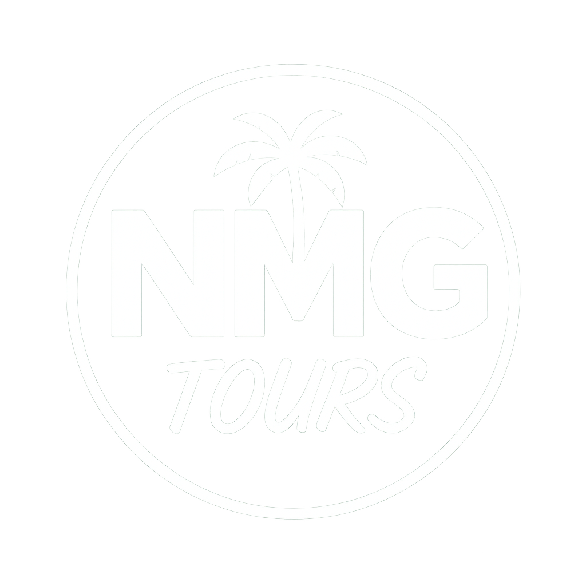

<p align="center">
  
</p>

<h1 align="center">🌴 NMG Tours JAM 🌊</h1>

<p align="center">
  <strong>Explore. Experience. Remember.</strong><br/>
  <a href="https://nmgtoursjam.com" target="_blank">nmgtoursjam.com</a>
</p>

<p align="center">
  <a href="https://nmgtoursjam.com/"></a>
  <a href="https://github.com/4eckd/nmgtoursjam/commits/main"></a>
  <a href="https://github.com/4eckd/nmgtoursjam/stargazers"></a>
  <a href="https://hits.sh/github.com/4eckd/nmgtoursjam/"></a>
</p>

<p align="center">
  <a href="https://nextjs.org/"></a>
  <a href="https://tailwindcss.com/"></a>
  <a href="https://vercel.com/"></a>
  <a href="https://pnpm.io/"></a>
  <a href="https://github.com/4eckd/nmgtoursjam/blob/main/LICENSE"></a>
</p>

---

## 🌍 About

Welcome to **NMG Tours JAM**, your gateway to unforgettable Jamaican adventures.
This repository powers [nmgtoursjam.com](https://nmgtoursjam.com/) — a modern, high-performance web app that connects travelers with authentic local experiences.

**Current Status**: MVP Development (60% Complete) | **Version**: 1.0.0 | **Branch**: `main`

> 📋 **Quick Links**: [MVP Status](MVP-STATUS.md) | [Main Baseline](MAIN_BASELINE.md) | [Documentation](docs/README.md) | [Development Guide](CLAUDE.md)

---

## 🎯 MVP Progress

```
Foundation:         ████████████████████████ 100% ✅
Database:           ████████████████████████ 100% ✅
Tours System:       ████████████████░░░░░░░░  80% 🚧
Authentication:     ████████████░░░░░░░░░░░░  60% 🚧
Booking & Payments: ░░░░░░░░░░░░░░░░░░░░░░░░   0% ⏳

Overall:            ████████████░░░░░░░░░░░░  60%
```

**What's Complete**:
- ✅ Complete design system (11 docs, 5 mockups, 80+ components planned)
- ✅ Database schema (10 models, Prisma ORM)
- ✅ API routes (6 endpoints)
- ✅ Tours listing & detail pages
- ✅ Authentication setup (NextAuth.js)
- ✅ CI/CD pipeline (4 GitHub Actions workflows)
- ✅ Performance monitoring (Lighthouse CI)

**Next Up**:
- 🚧 Complete tours search & filters
- 🚧 User dashboard
- ⏳ Booking flow & Stripe payments

---

## 🚀 Purpose

- Present the full range of NMG's curated tours and travel packages.
- Provide a smooth, mobile-first booking experience.
- Keep performance optimized with fast-loading images and lean code.
- Maintain a content-flexible structure so admins can easily update tours or pricing.  

---

## 📁 Project Structure  

```plaintext
nmgtoursjam/
│
├── src/              # Next.js pages, components, and utilities
├── public/           # Static assets (favicon, banner, images)
├── content/          # Tour and location metadata
├── styles/           # TailwindCSS configuration
├── package.json
└── CLAUDE.md         # AI assistant and dev context guide
````

---

## 🧑‍💻 Getting Started

```bash
# Clone the repository
git clone https://github.com/4eckd/nmgtoursjam.git

# Navigate into the project
cd nmgtoursjam

# Install dependencies
pnpm install

# Run local development server
pnpm dev
```

Then visit [http://localhost:3000](http://localhost:3000) to preview.

---

## 🛠️ Technology Stack

| Category            | Tools / Frameworks                                                       |
| :------------------ | :----------------------------------------------------------------------- |
| **Framework**       | [Next.js](https://nextjs.org/), [React](https://react.dev/)              |
| **Styling**         | [TailwindCSS](https://tailwindcss.com/), [PostCSS](https://postcss.org/) |
| **Deployment**      | [Vercel](https://vercel.com/)                                            |
| **Package Manager** | [pnpm](https://pnpm.io/)                                                 |
| **Version Control** | [GitHub](https://github.com/)                                            |
| **AI Reference**    | [`CLAUDE.md`](https://github.com/4eckd/nmgtoursjam/blob/main/CLAUDE.md)  |

---

## 🧭 Contributing

1. Create a new feature branch:

   ```bash
   git checkout -b feat/new-tour
   ```
2. Commit with clear messages:

   ```bash
   git commit -m "feat(tour): add Mystic Falls rainforest ziplines"
   ```
3. Push your branch and open a pull request.
4. Tag `@4eckd` for any core feature or design changes.

---

## 📸 Content Team Notes

* Add new tours in `/content` with image references and descriptions.
* Optimize all images before committing (use `.webp` or `.avif`).
* Include descriptive alt text for accessibility.
* Run `pnpm lint` before pushing to keep formatting consistent.

---

## 📈 Deployment

This site is automatically deployed to **Vercel** whenever changes are pushed to the `main` branch.
You can view build logs and deployments in the [Vercel Dashboard](https://vercel.com/dashboard).

---

## 📊 Metrics & Analytics

* **Page Views:** via [Hits.sh](https://hits.sh) badge above
* **GitHub Stars / Commits:** via Shields.io
* **Deployment Health:** through GitHub Deployments API

---

## 📚 Knowledge Base  
For in-depth guides, workflow notes, and team documentation, visit the  
👉 [NMG Tours JAM Knowledge Base](https://github.com/4eckd/nmgtoursjam/tree/main/docs)

---

## 📞 Support

For help or questions:

* Open an issue on GitHub
* Email: **[support@nmgtoursjam.com](mailto:support@nmgtoursjam.com)**
* Tag `@4eckd` for urgent deployment assistance

---

### ✨ “Let’s build memories that last a lifetime.”

> *NMG Tours JAM – Where every journey tells a story.*

---
